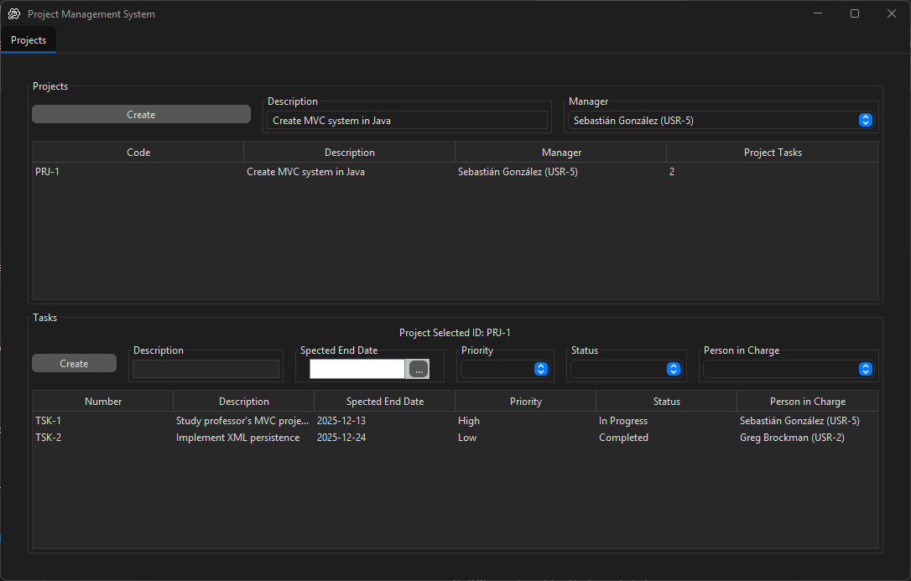
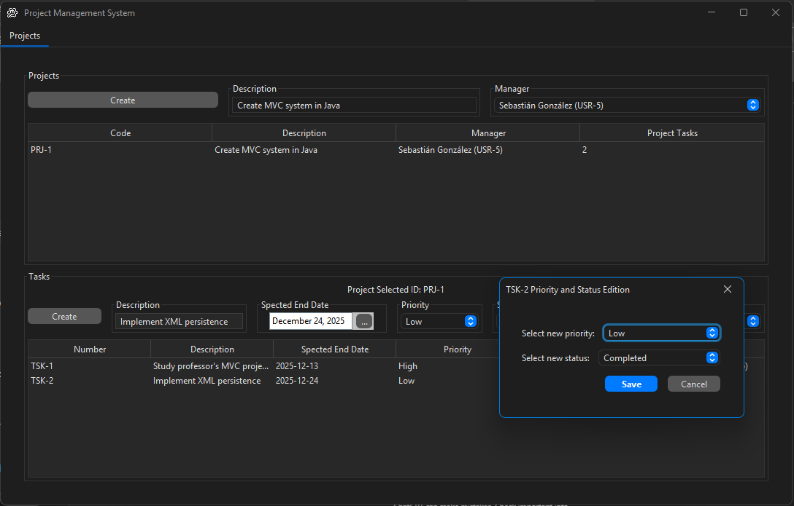

# Project Management System (Sistema de Gestión de Proyectos)


---

## 📋 Overview

This project is a **desktop application developed as the complete solution for Exam 1 of Programación 3 (Second Semester 2025)**.

The objective of the exam was to design and implement a **Project Management System** capable of managing projects, their associated tasks, and the users responsible for each task.

The application strictly follows a **Layered Architecture** and applies the **Model–View–Controller (MVC)** design pattern in the presentation layer.  
All system data (projects, tasks, and users) is **persisted using XML files**, as required by the exam specification.

---

## 🚀 Features

The system implements all required exam functionalities:

### 📁 Data Persistence
- **XML Persistence:** Automatically loads and saves Projects, Tasks, and Users to an XML file on startup and exit.

### 📌 Project Management
- View a list of all registered projects.
- Create new projects with **auto-generated project codes**.
- Assign a general manager to each project from the XML user list.
- Select a project to view its associated tasks.

### 📝 Task Management
- View tasks belonging to the selected project.
- Create new tasks with:
  - Description
  - Expected completion date
  - Priority (High, Medium, Low)
  - Assigned responsible user
- Visual feedback when no project is selected:
  - Displays **“no hay proyecto seleccionado”**
  - Task creation form is hidden until a project is selected.

### ✏️ Task Editing
- **Double-click** a task to open a pop-up editor.
- Modify:
  - **Priority** (High, Medium, Low)
  - **Status** (Open, In-Progress, In-Review, Resolved)

---

## 🖼️ Screenshots

> Screenshots of the application interface during execution.

### Application Startup
_When the application is launched and no project is selected._


---

### Project Selected
_View displaying the selected project and its associated tasks._



---

### Edit Task (Double Click)
_Pop-up window used to edit a task's priority and status._



---

## 🏗️ Architecture & Design

The project is structured using a **Layered Architecture**, ensuring clear separation of responsibilities:

### 1️⃣ Presentation Layer (`presentation`)
Handles the graphical user interface and user interaction using **MVC**.

- **View**
  - `BoardView`
  - `TaskEditionView`
- **Controller**
  - `Controller`
- **Model**
  - `Model`
  - `AbstractModel`

### 2️⃣ Logic Layer (`logic`)
Contains the business rules and domain entities.

- **Service**
  - `Service.java` — Singleton for business logic
- **Entities**
  - `Project`
  - `Task`
  - `User`
- **Utilities**
  - `IdGenerator`
  - `LocalDateAdapter`
  - `Priority` (Enum)
  - `Status` (Enum)

### 3️⃣ Data Layer (`data`)
Responsible for persistence and data handling.

- `Data.java` — Central data container
- `XmlPersister.java` — XML read/write operations

---

## 📂 Project Structure

```text
src/main/java
└── system
    │   Application.java           # Application entry point
    │
    ├── data
    │       Data.java              # Data container
    │       XmlPersister.java      # XML persistence handler
    │
    ├── logic
    │   │   Service.java           # Business logic facade
    │   │
    │   └── entities
    │       │   Project.java
    │       │   Task.java
    │       │   User.java
    │       │
    │       └── utilities
    │               IdGenerator.java
    │               LocalDateAdapter.java
    │               Priority.java
    │               Status.java
    │
    └── presentation
        │   AbstractModel.java
        │   AbstractTableModel.java
        │
        ├── board
        │       BoardView.form
        │       BoardView.java
        │       Controller.java
        │       Model.java
        │       ProjectsTableModel.java
        │       ProjectTasksTableModel.java
        │
        └── taskEdition
                TaskEditionView.form
                TaskEditionView.java
