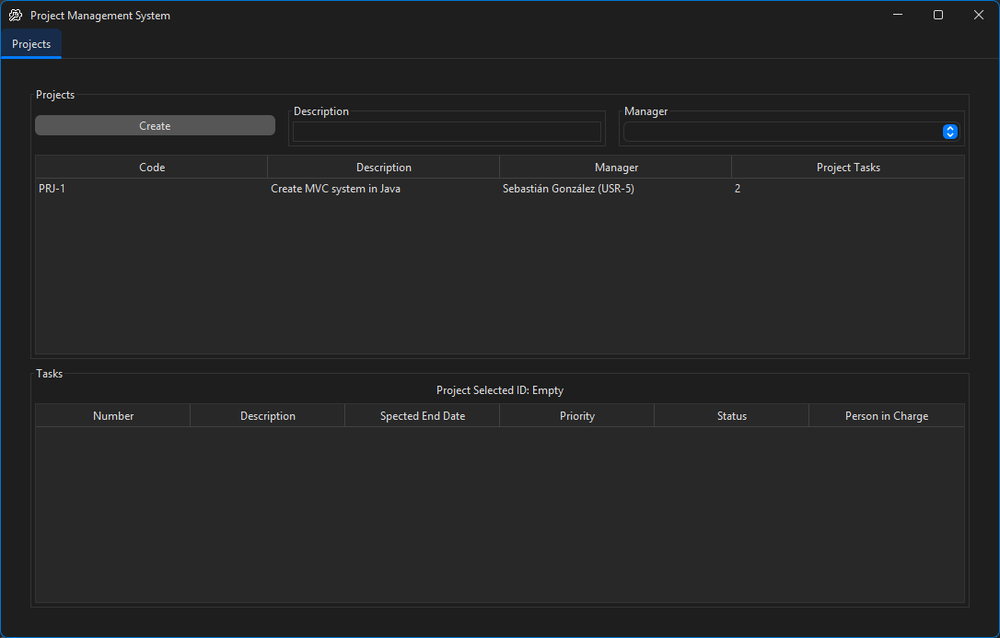
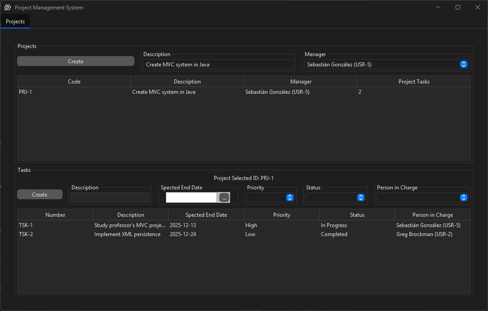
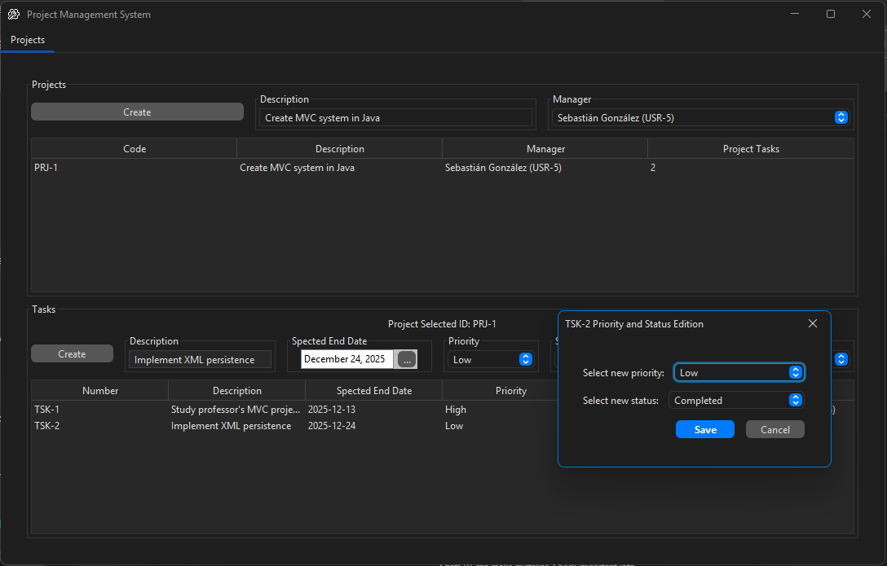

# Project Management System


Desktop application developed for **Exam 1** of **Programación 3 (Second Semester 2025)**.

The application manages projects, tasks, and users while following a layered architecture with the MVC pattern in the presentation layer. All information is persisted in XML files according to the assignment requirements.

## Features

- XML-based persistence for projects, tasks, and users.
- Project creation with automatically generated identifiers.
- Assignment of a project manager.
- Task creation with:
  - description
  - due date
  - priority
  - assigned user
- Task editing through a dedicated dialog.
- Automatic loading and saving of application data.

## Screenshots

### Main Window



### Project Selected



### Task Editor



## Architecture

```
Presentation (MVC)
│
├── View
├── Controller
└── Model

Logic
│
├── Service
└── Domain Entities

Data
│
└── XML Persistence
```

The project is organized into three main layers:

- **Presentation** – Swing interface implemented using MVC.
- **Logic** – Business rules and domain entities.
- **Data** – XML serialization and persistence.

## Project Structure

```text
src/main/java/system
├── data
├── logic
└── presentation
```

## Technologies

- Java
- Java Swing
- XML Persistence
- Layered Architecture
- Model–View–Controller (MVC)

## Author

**Sebastián David González Masis**  
Programación 3 – Exam 1 (2025)
